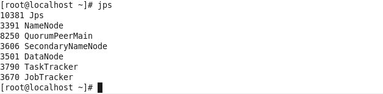
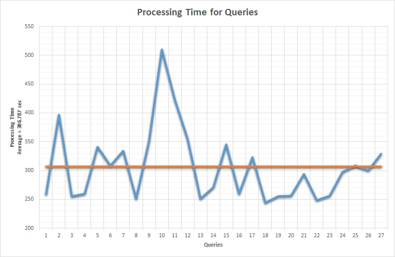

# Final Report

##Introduction
When we think of an open source community, we find projects for achieving a myriad of different solutions spanning across various real world challenges. So, our goal through this project is to find information about the API usage i.e. classes and programming language usage in big and small communities (like stack overflow, koders.com, Apache, Github etc) and collect their frequency of usage. 

The data sets of these communities are huge and to query such huge data sets it can take significant time on a commodity hardware. Hence, we made use of Hadoop’s distributed approach to parallelize the processing of queries. Further sections discuss about the configuration and installment of Hadoop and required components, data processing and the results that we obtained for the exploration that we did for the research questions that we had targeted.

##Platform setup
Considering the constraints of the machine and the necessity for processing huge data sets we decided to install a Hadoop cluster of 2 Virtual Machines. Each machine had 1 core, 2 GB RAM and storage capacity of up to 200 GB. We describe each services that are installed and the configuration steps.

###Hadoop
The [**Apache Hadoop**](http://hadoop.apache.org/) software foundation was implemented to provide distributed processing of large data sets by using commodity machines which can provide local computation and storage facilities. Since, these commodity machines are highly prone to occasional failures and breakdown yet the Hadoop is designed to be tolerant to these failures and still achieve these results. 

We are making use of **Hadoop project version 1.2.1** which comes along with two components **Hadoop distributed file system and MapReduce framework**. The HDFS is a distributed file system which gives a coherent view of the files that might be stored across different machines in the cluster. The HDFS has two components: **namenode** (also called as master for HDFS) is used to store the metadata about the files stored in HDFS and datanode is the actual storage of data. And **MapReduce** is used to perform the processing on the data sets stored on HDFS. Each of the tasks that are requested is first translated into Map and Reduce form and then made to run. The handling of each such jobs is done by JobTracker(master for handling jobs) which oversees all the jobs right from allocation of job to management as well and there is also TaskTracker which is responsible for handling of each tasks that are part of one job.

In our installation phase the VM 1 has Namenode, Jobtracker, Tasktracker and Datanode and VM 2 has Datanode and Tasktracker. So effectively, we have 1 master and 2 worker entities where VM 1 has both master and worker working 
synchronously.

The Haddop Configuration we have done is documented in **[Hadoop Configuration](Queries_and_Configuration/HadoopConfig.md)**

A view of the JobTracker UI on the Master Node is as follows:

A view of the DFS UI is as follows:

###Apache Hive
The [**Apache Hive**](https://cwiki.apache.org/confluence/display/Hive/Tutorial) is designed to enable easy data summarization, ad-hoc querying and analysis of large volumes of data. It comes with HiveQL which enables traditional SQL users to perform task on Hadoop like by writing SQL like queries for data processing and it also allows the task to be done through MapReduce framework too. Hence, we decided on using Hive to ease out the process for getting the result and writing simple queries to perform hadoop distributed jobs. Apache Hive installation is relatively simple and it just requires presence of the binaries on that machine to run the service. Each query that is given to Hive is translated into Mapreduce job and made to run on HDFS.

But while performing simple basic queries performed on data sets as huge as **30 GB**, each task would take many hours to finish the job. This is certainly not desirable in our case hence we decided to make use of other dataset to experiment our setup and try to find out relevant answers to our research questions.

The jps command shows the following processes running upon starting the Hadoop services: 
**On Master Node (VM1):** 
*[root@localhost ~]# jps *
*10381 Jps *
*3391 NameNode *
*3606 SecondaryNameNode *
*3501 DataNode *
*3790 TaskTracker *
*3670 JobTracker *
*[root@localhost ~]#*

**On Slave Node (VM2):** 
*[root@localhost ~]# jps* 
*4541 DataNode* 
*11776 Jps* 
*4618 TaskTracker* 
*[root@localhost ~]#*  

As we see, in the Master Node, *NameNode* & *JobTracker* is running. The *DataNode* & *Task Tracker* are running on both nodes.

##Data Processing
Our research goals involve analyzing huge social communities like stackoverflow, koders and github. To start with our study we are as of now considering programmers.stackexchange dataset which has posts as main tag and many sub-fields. Each row of table has many fields and values related to posts but initially we decided to use following fields **creation date** (signifying the date when post was posted on forum), **score** (based on the score given to the post), **viewcount** (signifying how many hits that post has among users), **body** (stores the content of post), **last activity date** (this is the last time when either there was a comment or update on post) , **title** (the title of post), **tags** (tags associated with post), **answercount** (the number of answers given to that post), **commentcount** (the number of comments), and **favoritecount** (how popular this post is among users) to not only answer our research questions but also look for further scope of questions. However, including all the fields had increased the data size to huge volume which prompted us to reduce the size and hence we had to cut down on these fields. So for feasibility we decided to use row_Id and Body fields as these were the primary fields relevant for our domain. 

Aware of the fact that the query processing for a huge set of data will take upto hours or even days, we made use of Map data type supported by HiveQL for easing the access time of each row. Hence, each row_Id is used as a key and Body field is used as a value.

We parsed through the XML dump that we got from the [web-store](https://archive.org/details/stackexchange). Since the data was already present in XML format not much cleaning was required to be done on that data set. But we had an additional challenge of loading these into Hive created tables and in a format that can be understood by HiveQL. To parse through the XML dump and load into tables we make use of [hivexmlserde](https://github.com/dvasilen/Hive-XML-SerDe/wiki/XML-data-sources) jar which helps us in parsing through the required fields from xml dump. 

The steps to perform for reading through xml are as follows:

* Load the xml data set into either local directory or HDFS.
* Create a table with necessary columns and also include information about the xml file like beginning and ending of xml tags and the mapping of attributes to corresponding columns.
* Once the table is create we load the table by reading through the file. This will parse and fill the rows and columns.

Once the table is ready, the results can be extracted out easily by passing SQL queries with slight syntax modifications for use in Hive.

The data processing queries we ran are included in **[Data Processing](Queries_and_Configuration/Data_processing.md)**

##Research Questions & Results:
Through the configuration of Hadoop, loading of data set, creation of queries, and the results (list of queries are present in **[Queries and Result](Queries_and_Configuration/Queries.md)** ) we have reached a conclusion for the research questions for our project.

#####What are the more commonly used APIs in Java & how many issues are faced in them?

We selected some of the more popular APIs in Java and the classes they encompass in order to ascertain their count of occurrences. A graphical representation of the results obtained are as follows:

As we can see, the maximum occurrences are 911 and it is for the Collections API. This contains the various data structures used in programming. Next in terms of occurences, was the Thread API. The lowest in our list was the EventHandlers API having KeyEvent, ActionEvent & MouseEvent.

Hence, the Collections API and the Thread API are the most widely discussed Java APIs on programmers.stackexchange.com. This tells us that since a lot of people use the data structures and classes under these API, that is why they come across issues and post queries on the site to get answers.

#####Which is the most widely used data structure in Java?
In order to gauge the answer to this, we queried the data set to find the count of the popular Java data structures - Arrays, ArrayLists, HashMap, HashList, Vectors, LinkedList,LinkedHashList, HashSet & TreeMap. The data is as represented below:

From the graph, it is seen that ArrayList is the most popular data structure in Java and most people have posted queries of ArrayList in the site. It features 253 queries. If ArrayList was not used, programmers would not get any queries regarding it Hence, we can safely assume that ArrayList is the most famous, followed by Vector & HashMap.

#####In Java, out of the popular I/O methods, which is the most used?
For this research question, we selected the well known input and output methods and searched for their occurrence in the data set. We found that out of the input methods, Scanner class is used the maximum with 47% when compared to other widely used classes. BufferredReader is used second highest with 34% of the input methods. DataInputStream constitutes of only 2%. This might be due to the ease and flexibility of the Scanner class as an input method. 

For output operations, FileOutputStream has a share of 58% of the popular output methods in Java. No queries of DataOutputStream are present. This could be due to the lack of exposure /documentation for DataOutPutStream or could simply be because of ease of operation of the other methods.

#####Performance of queries on Hadoop using Hive.

In the 2 node Hadoop cluster, we ran modified SQL queries compatible with Hive in order to answer the research questions and also to gauge the processing time for the queries. The data set was about 300MB in size. the Hive queries are converted internally to map-reduce jobs and are executed. The queries and their processing time are found in **[Extracted Data](Result_Sets/Extracted_Data.xlsx)**
As we see in the graph, the average time to get the results was a little less than 307 sec. This depends on the hardware specifications of the server and its processing capabilities. The fastest was 244.1 seconds and the slowest was 510 seconds.

##Issues:

During the configuration of Hadoop & Hive, we have faced multiple issues that we had to overcome. A list of the issues are as follows:

* While installing Hadoop cluster using the Ambari agent, the operation kept throwing errors stating that the mirrors did not exist. Multiple sources revealed the same issue.

* Setting up the correct environment variables for Hadoop and Java posed an issue due to multiple java versions being present on the node.

* JPS command was not working on the slave node. Deleted all versions of java and reinstalled version 1.7 build 71 to solve the issue.
* Apache Hive 0.13 that was downloaded was missing some jar files that was needed to run hive for Hadoop version 1.2.1. Deleted this version of hive and installed version 0.12. This solved the issue.

* Since both the nodes are present on the same machine as 2 VM, loading of the data into HDFS and running a map-reduce job for a query is taking a long time to complete. We are looking into reasons arising from having 2 VMs on the same machine.

##Limitations:
The use of Hadoop and especially running two node cluster in a single machine had made us face a lot of issues itself but apart from this we also have certain logical limitations in terms of the way we extracted the results for our empirical study.

* We did absolute pattern matching in the body field with trying to look for the occurence of key words related to some common API. But a user might just use a part of the functionality of a class without mentioning key class name and just mentioning a certain line from the code. In such a case the field might have been ignored completely.
* There might also be a case where user might have faced a problem in some other class but still might have included just as the part of code. This would increase false positive on our results.

##Conclusion:
We successfully modeled a methodology to identify and find out what are some popular methodologies or steps being used by developers and where are most of the issues being faced by community by using simple frequency count of the API. Our methodology can be successfully adopted on any dataset and for any size irrespective of the infrastructure as we made use of Hadoop's distributed,powerful and cheap processing of big data.

##Links and References:##
* **[Trello Board](https://trello.com/b/q3DYdY8B/empirical-apiusage)**
* Chris Parnin, Christoph Treude, Lars Grammel, and Margaret-Anne Storey. *Crowd Documentation: Exploring the Coverage and the Dynamics of API Discussions on Stack Overflow.* Technical Report GIT-CS-12-05, Georgia Tech, 2012.
* **[Hive Queries References](https://cwiki.apache.org/confluence/display/Hive/Tutorial)**

