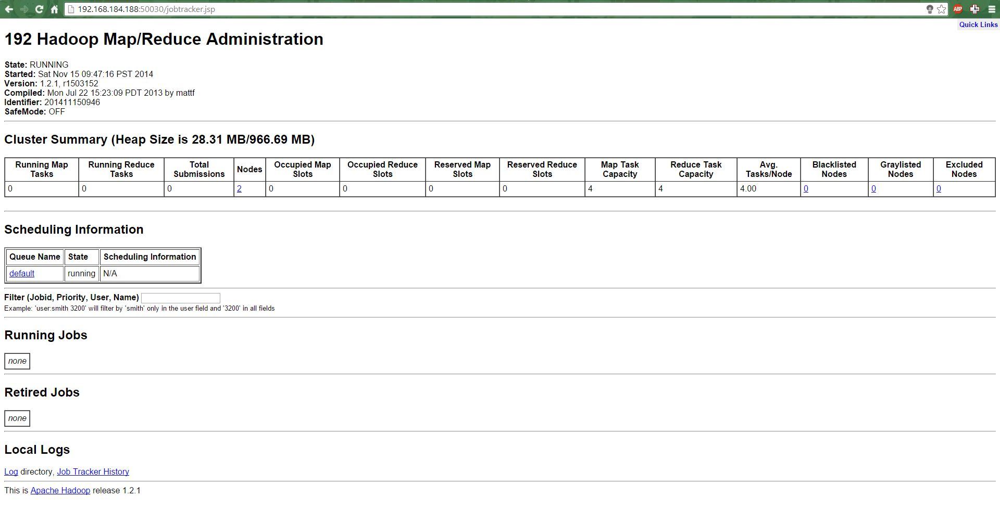
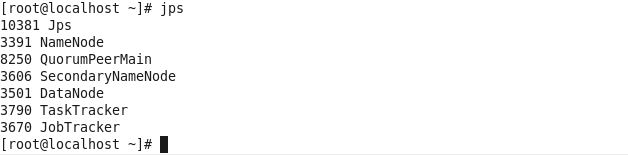
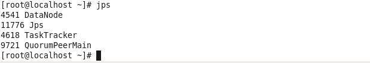

# Final Report- Draft

##Introduction
When we think of an open source community, we find projects for achieving a myriad of different solutions spanning across various real world challenges. So, our goal through this project is to find information about the API usage i.e. classes and programming language usage in big and small communities (like stack overflow, koders.com, Apache, Github etc) and collect their frequency of usage. 

The data sets of these communities are huge and to query such huge data sets it can take significant time on a commodity hardware. Hence, we made use of Hadoop’s distributed approach to parallelize the processing of queries. Further sections discuss about the configuration and installment of Hadoop and required components, data processing and the work done till now. We end up by discussing about the further steps that are being planned to finish up the project.

##Platform setup
Considering the constraints of the machine and the necessity for processing huge data sets we decided to install a Hadoop cluster of 2 Virtual Machines. Each machine had 1 core, 2 GB RAM and storage capacity of up to 200 GB. We describe each services that are installed and the configuration steps.

###Hadoop
The [**Apache Hadoop**](http://hadoop.apache.org/) software foundation was implemented to provide distributed processing of large data sets by using commodity machines which can provide local computation and storage facilities. Since, these commodity machines are highly prone to occasional failures and breakdown yet the Hadoop is designed to be tolerant to these failures and still achieve these results. 

We are making use of **Hadoop project version 1.2.1** which comes along with two components **Hadoop distributed file system and MapReduce framework**. The HDFS is a distributed file system which gives a coherent view of the files that might be stored across different machines in the cluster. The HDFS has two components: **namenode** (also called as master for HDFS) is used to store the metadata about the files stored in HDFS and datanode is the actual storage of data. And **MapReduce** is used to perform the processing on the data sets stored on HDFS. Each of the tasks that are requested is first translated into Map and Reduce form and then made to run. The handling of each such jobs is done by JobTracker(master for handling jobs) which oversees all the jobs right from allocation of job to management as well and there is also TaskTracker which is responsible for handling of each tasks that are part of one job.

In our installation phase the VM 1 has Namenode, Jobtracker, Tasktracker and Datanode and VM 2 has Datanode and Tasktracker. So effectively, we have 1 master and 2 worker entities where VM 1 has both master and worker working 
synchronously.

The Haddop Configuration we have done is documented in **[Hadoop Configuration](HadoopConfig.md)**

A view of the JobTracker UI on the Master Node is as follows:

A view of the DFS UI is as follows:

###Apache Hive
The [**Apache Hive**](https://cwiki.apache.org/confluence/display/Hive/Tutorial) is designed to enable easy data summarization, ad-hoc querying and analysis of large volumes of data. It comes with HiveQL which enables traditional SQL users to perform task on Hadoop like by writing SQL like queries for data processing and it also allows the task to be done through MapReduce framework too. Hence, we decided on using Hive to ease out the process for getting the result and writing simple queries to perform hadoop distributed jobs. Apache Hive installation is relatively simple and it just requires presence of the binaries on that machine to run the service. Each query that is given to Hive is translated into Mapreduce job and made to run on HDFS.

But while performing simple basic queries performed on data sets as huge as **30 GB**, each task would take many hours to finish the job. This is certainly not desirable in our case hence we decided to make use of other framework which would offer us a structured way of storing files into Hadoop to increase the speed of processing each such job.

###Zookeeper
The [**Apache Zookeeper**](http://zookeeper.apache.org/) project is more of a synchronization services designed to maintain the synchronization among different nodes in the cluster. This service was installed as a prerequisite for HBase. 
The zookeeper server is required to be present in all the nodes of a cluster so currently both our VMs are running zookeeper services.

###HBase
The [**Apache HBase**](http://hbase.apache.org/) project was implemented to provide random read and write access to large data sets stored on hadoop. It is specifically designed to handle big data by storing these datasets in the form of tables and columns and containing millions of rows. Our target of using this project is to store the data sets of the communities that we obtained so our queries can be made faster and we might even be able to evaluate more research questions pertaining to our domain.

We configured VM2 to be our HBase server and VM1 as HBase client.

The jps command shows the following processes running upon starting the Hadoop services: 
**On Master Node (VM1):** 
*[root@localhost ~]# jps *
*10381 Jps *
*3391 NameNode *
*8250 QuorumPeerMain *
*3606 SecondaryNameNode *
*3501 DataNode *
*3790 TaskTracker *
*3670 JobTracker *
*[root@localhost ~]#*

**On Slave Node (VM2):** 
*[root@localhost ~]# jps* 
*4541 DataNode* 
*11776 Jps* 
*4618 TaskTracker* 
*9721 QuorumPeerMain* 
*[root@localhost ~]#*  

As we see, in the Master Node, *NameNode* & *JobTracker* is running. The *DataNode* & *Task Tracker* are running on both nodes.

The *QuoromPeerMain* shows that the HBase is also running on the servers.

##Data Processing
Our research goals involve analyzing huge social communities like stackoverflow, koders and github. To start with our study we are as of now considering stackoverflow dataset which has posts. Each row of table has many fields and values related to posts but for domain we decided to use following fields **creation date** (signifying the date when post was posted on forum), **score** (based on the score given to the post), **viewcount** (signifying how many hits that post has among users), **body** (stores the content of post), **last activity date** (this is the last time when either there was a comment or update on post) , **title** (the title of post), **tags** (tags associated with post), **answercount** (the number of answers given to that post), **commentcount** (the number of comments), and **favoritecount** (how popular this post is among users). 

We parsed through the XML dump that we got from the [web-store](https://archive.org/details/stackexchange). Since the data was already present in XML format not much cleaning was required to be done on that data set. But we had an additional challenge of loading these into Hive created tables and in a format that can be understood by HiveQL. To parse through the XML dump and load into tables we make use of [hivexmlserde](https://github.com/dvasilen/Hive-XML-SerDe/wiki/XML-data-sources) jar which helps us in parsing through the required fields from xml dump. 

The steps to perform for reading through xml are as follows:

* Load the xml data set into either local directory or HDFS.
* Create a table with necessary columns and also include information about the xml file like beginning and ending of xml tags and the mapping of attributes to corresponding columns.
* Once the table is create we load the table by reading through the file. This will parse and fill the rows and columns.

Once the table is ready, the results can be extracted out easily by passing simple SQL queries.

The data processing queries we ran are included in **[Data Processing](Queries_and_Configurations/Data_processing.md)**

##Research Questions:
The main research questions that we have to address through our project can be stated as follows:

* To pass queries on the data sets so as to assess the frequency of usage of the common APIs present in the Java programming language.

* We also want to find out how quickly and what percentage of the issues for the APIs are resolved.

* The analyses would give us an idea as to which of the APIs are more popular than the others and which ones are tougher leading to higher issues being posted.

* Another question to answer was to find out how effective the Hadoop environment of 2 nodes ( of certain hardware constraints) would be to parallely process the queries on a data set size of 30GB.

##Issues:

During the configuration of Hadoop & Hive, we have faced multiple issues that we had to overcome. A list of the issues are as follows:

* While installing Hadoop cluster using the Ambari agent, the operation kept throwing errors stating that the mirrors did not exist. Multiple sources revealed the same issue.

* Setting up the correct environment variables for Hadoop and Java posed an issue due to multiple java versions being present on the node.

* JPS command was not working on the slave node. Deleted all versions of java and reinstalled version 1.7 build 71 to solve the issue.
* Apache Hive 0.13 that was downloaded was missing some jar files that was needed to run hive for Hadoop version 1.2.1. Deleted this version of hive and installed version 0.12. This solved the issue.

* Since both the nodes are present on the same machine as 2 VM, loading of the data into HDFS and running a map-reduce job for a query is taking a long time to complete. We are looking into reasons arising from having 2 VMs on the same machine.

##Further Steps:
Since we have now almost configured ZooKeeper and HBase and have loaded the data into HDFS, we can go about running the queries on the loaded data set. We will run queries on the Posts.xml data set so as to:

* Get the count of certain JAVA APIs to get their frequency of usage in the Body and Tags attributes.

* Get an idea about how many of the questions have been answered and how many are pending.

* Find a connection between popularity and frequency of the API usage.

* Create graphs of the inferences to provide an appropriate view to easil understand the findings graphically.
